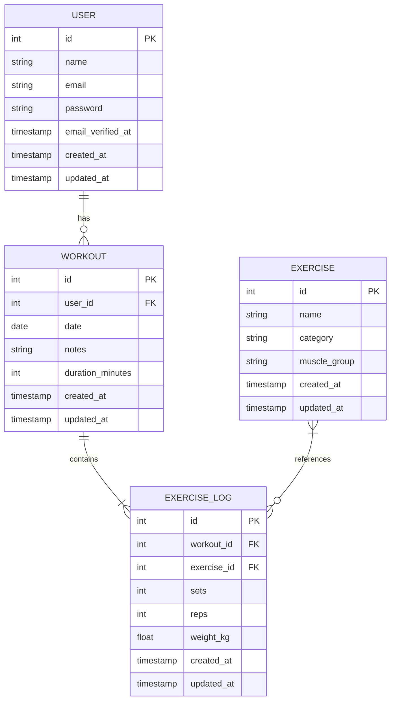
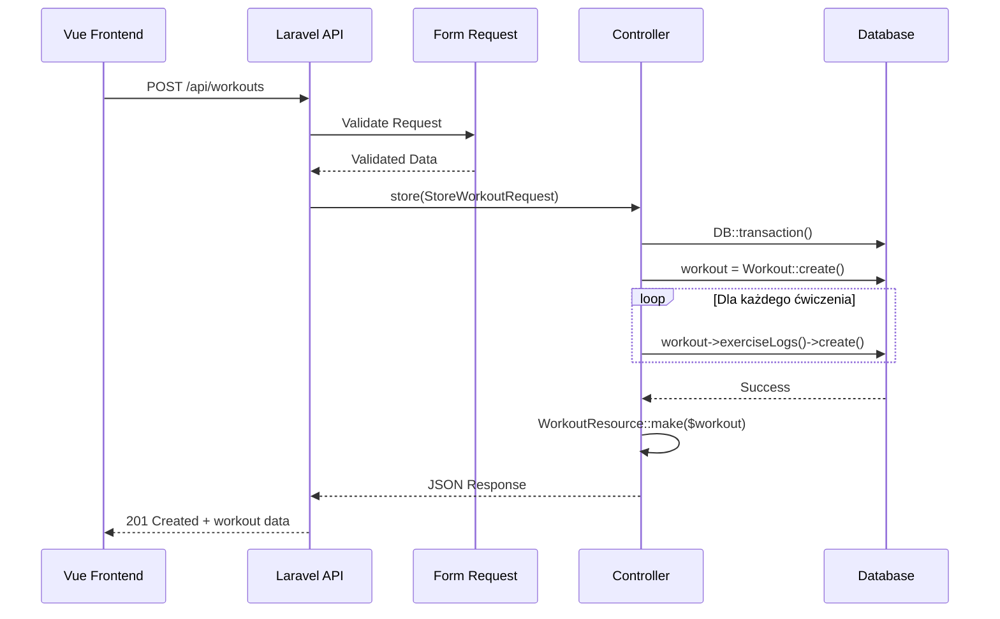
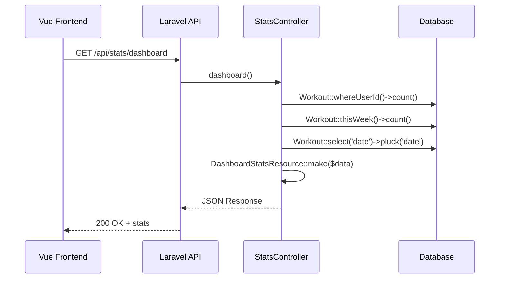

# 🏗️ FitBoard - Dokumentacja Architektoniczna

**Wersja:** 1.0  
**Data:** 2026-03-16  
**Stack:** Vue 3 + Laravel 11 + SQLite

---

## 1. Overview

FitBoard to aplikacja do śledzenia treningów siłowych. Architektura opiera się na podejściu **API-First** - frontend Vue komunikuje się z backendem Laravel przez REST API.

### Kluczowe Założenia
- **Solo Developer Friendly** - minimalna złożoność, maksymalna czytelność
- **SQLite w dev** - zero konfiguracji bazy danych na etapie developmentu
- **Sanctum** - najprostsza autentykacja SPA
- **Resource Classes** - czyste i spójne odpowiedzi JSON

---

## 2. Diagram ERD



### Opis Relacji

| Relacja | Typ | Opis |
|---------|-----|------|
| User → Workout | 1:N | Użytkownik ma wiele treningów |
| Workout → ExerciseLog | 1:N | Trening zawiera wiele wpisów ćwiczeń |
| Exercise → ExerciseLog | 1:N | Jedno ćwiczenie może być w wielu treningach |

---

## 3. Struktura Katalogów

```
fitboard-project/
├── backend/                          # Laravel 11 API
│   ├── app/
│   │   ├── Http/
│   │   │   ├── Controllers/
│   │   │   │   ├── Api/
│   │   │   │   │   ├── AuthController.php
│   │   │   │   │   ├── WorkoutController.php
│   │   │   │   │   ├── ExerciseController.php
│   │   │   │   │   └── StatsController.php
│   │   │   │   └── Controller.php
│   │   │   ├── Requests/
│   │   │   │   ├── Auth/
│   │   │   │   │   ├── LoginRequest.php
│   │   │   │   │   └── RegisterRequest.php
│   │   │   │   └── Workout/
│   │   │   │       ├── StoreWorkoutRequest.php
│   │   │   │       └── UpdateWorkoutRequest.php
│   │   │   └── Resources/
│   │   │       ├── UserResource.php
│   │   │       ├── WorkoutResource.php
│   │   │       ├── ExerciseResource.php
│   │   │       ├── ExerciseLogResource.php
│   │   │       └── DashboardStatsResource.php
│   │   └── Models/
│   │       ├── User.php
│   │       ├── Workout.php
│   │       ├── Exercise.php
│   │       └── ExerciseLog.php
│   ├── config/
│   ├── database/
│   │   ├── factories/
│   │   ├── migrations/
│   │   └── seeders/
│   │       └── ExerciseSeeder.php
│   ├── routes/
│   │   └── api.php
│   ├── tests/
│   │   └── Feature/
│   │       ├── AuthTest.php
│   │       ├── WorkoutTest.php
│   │       └── StatsTest.php
│   └── .env
│
└── frontend/                         # Vue 3 (osobny projekt)
    └── ...
```

---

## 4. Przepływ Danych

### 4.1 Tworzenie Treningu



### 4.2 Pobieranie Dashboard Stats



---

## 5. Wybór Technologii

### 5.1 Backend - Laravel 11

| Technologia | Uzasadnienie |
|-------------|--------------|
| **Laravel 11** | Najnowsza wersja, mniej boilerplate, lepsza struktura |
| **SQLite** | Zero konfiguracji, wystarczające na projekt studencki |
| **Sanctum** | Najprostsza autentykacja API, idealna dla SPA |
| **Eloquent Resources** | Czyste formatowanie JSON, łatwa transformacja danych |
| **Form Requests** | Separacja walidacji od logiki kontrolera |

### 5.2 Dlaczego Sanctum zamiast JWT?

| Kryterium | Sanctum | JWT |
|-----------|---------|-----|
| Poziom trudności | ⭐ Łatwy | ⭐⭐⭐ Średni |
| Dokumentacja | Świetna | Dobra |
| Token refresh | Automatyczny | Manualny |
| Przydatność w projekcie | SPA + API | Tylko API |

**Decyzja:** Sanctum - prostszy w implementacji, wystarczający dla projektu studenckiego.

### 5.3 Dlaczego SQLite?

| Kryterium | SQLite | MySQL |
|-----------|--------|-------|
| Setup | Zero konfiguracji | Wymaga serwera |
| Backup | Plik .sqlite | Dump bazy |
| Wydajność | Wystarczająca | Lepsza przy milionach rekordów |
| Portability | Jeden plik | Serwer + konfiguracja |

**Decyzja:** SQLite na dev + MySQL config na prod (jeśli wymagane przez prowadzącego).

---

## 6. Endpointy API

### 6.1 Autentykacja

| Metoda | Endpoint | Opis | Auth |
|--------|----------|------|------|
| POST | `/api/register` | Rejestracja nowego użytkownika | ❌ |
| POST | `/api/login` | Logowanie, zwraca token | ❌ |
| POST | `/api/logout` | Wylogowanie, unieważnia token | ✅ |
| GET | `/api/user` | Dane zalogowanego użytkownika | ✅ |

### 6.2 Treningi

| Metoda | Endpoint | Opis | Auth |
|--------|----------|------|------|
| GET | `/api/workouts` | Lista treningów (paginacja) | ✅ |
| GET | `/api/workouts/{id}` | Szczegóły treningu | ✅ |
| POST | `/api/workouts` | Tworzenie treningu | ✅ |
| PUT | `/api/workouts/{id}` | Aktualizacja treningu | ✅ |
| DELETE | `/api/workouts/{id}` | Usuwanie treningu | ✅ |

### 6.3 Ćwiczenia i Statystyki

| Metoda | Endpoint | Opis | Auth |
|--------|----------|------|------|
| GET | `/api/exercises` | Lista dostępnych ćwiczeń | ✅ |
| GET | `/api/stats/dashboard` | Agregowane statystyki | ✅ |
| GET | `/api/stats/progress/{exercise_id}` | Progres dla ćwiczenia | ✅ |
| GET | `/api/stats/activity` | Dane do heatmapy | ✅ |

---

## 7. Modele i Relacje

### 7.1 User
```php
class User extends Authenticatable
{
    protected $fillable = ['name', 'email', 'password'];
    
    public function workouts()
    {
        return $this->hasMany(Workout::class);
    }
}
```

### 7.2 Workout
```php
class Workout extends Model
{
    protected $fillable = ['user_id', 'date', 'notes', 'duration_minutes'];
    protected $casts = ['date' => 'date'];
    
    public function user()
    {
        return $this->belongsTo(User::class);
    }
    
    public function exerciseLogs()
    {
        return $this->hasMany(ExerciseLog::class);
    }
}
```

### 7.3 Exercise
```php
class Exercise extends Model
{
    protected $fillable = ['name', 'category', 'muscle_group'];
    
    public function exerciseLogs()
    {
        return $this->hasMany(ExerciseLog::class);
    }
}
```

### 7.4 ExerciseLog
```php
class ExerciseLog extends Model
{
    protected $fillable = [
        'workout_id', 'exercise_id', 
        'sets', 'reps', 'weight_kg'
    ];
    
    public function workout()
    {
        return $this->belongsTo(Workout::class);
    }
    
    public function exercise()
    {
        return $this->belongsTo(Exercise::class);
    }
}
```

---

## 8. Walidacja Danych

### 8.1 StoreWorkoutRequest

```php
public function rules(): array
{
    return [
        'date' => 'required|date',
        'notes' => 'nullable|string|max:500',
        'duration_minutes' => 'nullable|integer|min:1|max:300',
        'exercises' => 'required|array|min:1',
        'exercises.*.exercise_id' => 'required|exists:exercises,id',
        'exercises.*.sets' => 'required|integer|min:1|max:20',
        'exercises.*.reps' => 'required|integer|min:1|max:100',
        'exercises.*.weight_kg' => 'required|numeric|min:0|max:500',
    ];
}
```

---

## 9. Bezpieczeństwo

### 9.1 Polityka Autoryzacji

- **WorkoutPolicy** - użytkownik może operować TYLKO na własnych treningach
- **Sanctum Middleware** - wszystkie endpointy poza auth wymagają tokena
- **CORS** - dozwolone żądania tylko z domeny frontendu

### 9.2 Rate Limiting

```php
RateLimiter::for('api', function (Request $request) {
    return Limit::perMinute(60)->by($request->user()?->id ?: $request->ip());
});

RateLimiter::for('auth', function (Request $request) {
    return Limit::perMinute(5)->by($request->ip());
});
```

---

## 10. Potencjalne Problemy i Rozwiązania

| Problem | Ryzyko | Rozwiązanie |
|---------|--------|-------------|
| **N+1 Query** | Średnie | Eager loading z `with()` |
| **Transakcje** | Wysokie | `DB::transaction()` przy zapisie |
| **CORS** | Niskie | Konfiguracja w `config/cors.php` |
| **Duża liczba ćwiczeń** | Niskie | Paginacja dla `/api/exercises` |

---

## 11. Środowiska

### 11.1 Development
- **Baza:** SQLite
- **URL:** `http://localhost:8000`
- **Frontend:** `http://localhost:5173`
- **CORS:** Allow all origins

### 11.2 Production (jeśli wymagane)
- **Baza:** MySQL
- **APP_ENV:** production
- **APP_DEBUG:** false
- **CORS:** Specific origin only

---

## 12. Rozwój w Przyszłości

Funkcjonalności, które mogą być dodane w przyszłości:

1. **Social features** - znajomi, udostępnianie treningów
2. **Plan treningowy** - predefiniowane plany
3. **Integracje** - Google Fit, Apple Health
4. **AI recommendations** - sugestie na podstawie progresu
5. **Export PDF** - raporty treningowe

---

**Następny krok:** Zobacz [`API.md`](./fitboard-api.md) dla szczegółowej dokumentacji endpointów.
