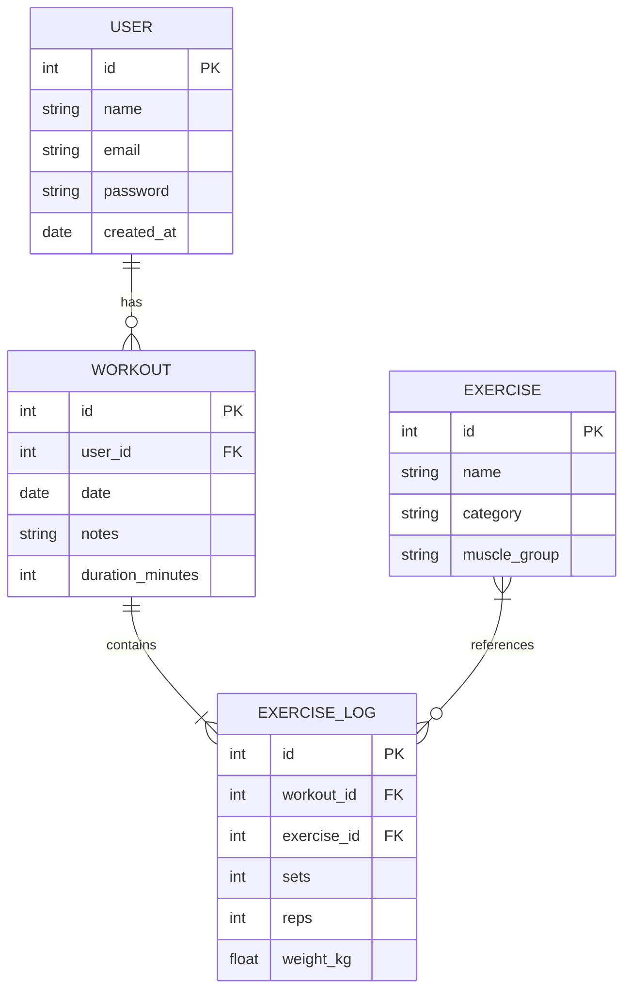
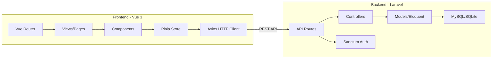

# 🎯 WF_MVP_Scoping – FitBoard

**Cel:** Zdefiniować absolutne minimum funkcji, które tworzą działający produkt wartościowy dla użytkownika i spełniający wymagania projektu studenckiego.

**Wymagania projektu:** Vue (frontend) + Laravel (backend) + dokumentacja + prezentacja

---

## 1. Filozofia MVP

> **Zasada:** Lepiej mieć 3 ekrany, które działają perfekcyjnie, niż 8 ekranów, które się sypią na prezentacji.

FitBoard MVP to **dashboard treningowy z 4 kluczowymi ekranami**, backendem REST API w Laravel i jednym wyróżnikiem wizualnym (heatmapa aktywności).

---

## 2. Model Danych (ERD)



**4 tabele. Nic więcej.** To wystarczy na pełny CRUD + wykresy + heatmapę.

---

## 3. Priorytetyzacja Funkcji – MoSCoW

### ✅ MUST HAVE (bez tego projekt nie ma sensu)

| # | Funkcja | Frontend | Backend |
|---|---|---|---|
| 1 | **Rejestracja i logowanie** | Formularz login/register | Laravel Sanctum/Breeze auth |
| 2 | **Dashboard główny** | Podsumowanie: ostatni trening, liczba treningów w tym tygodniu, heatmapa aktywności | GET /api/workouts z agregacjami |
| 3 | **Dodawanie treningu** | Formularz: data, ćwiczenia, serie, powtórzenia, ciężar | POST /api/workouts |
| 4 | **Lista historii treningów** | Tabela/lista z filtrami po dacie | GET /api/workouts z paginacją |
| 5 | **Widok szczegółów treningu** | Rozwinięcie treningu z listą ćwiczeń | GET /api/workouts/:id |
| 6 | **1 wykres postępów** | Wykres liniowy: progres ciężaru na wybranym ćwiczeniu w czasie | GET /api/stats/progress/:exercise_id |

### 🟡 SHOULD HAVE (dodatkowa wartość, ale projekt działa bez tego)

| # | Funkcja | Opis |
|---|---|---|
| 7 | **Heatmapa aktywności** | Kafelki w stylu GitHub contribution graph – pokazuje dni z treningami |
| 8 | **Edycja i usuwanie treningu** | Pełen CRUD (nie tylko Create + Read) |
| 9 | **Filtrowanie po grupie mięśniowej** | Dropdown w historii treningów |
| 10 | **Responsywny design** | Mobile-first layout |

### 🔵 COULD HAVE (nice-to-have, jeśli starczy czasu)

| # | Funkcja | Opis |
|---|---|---|
| 11 | **Streak counter** | Ile dni/tygodni z rzędu trenujesz |
| 12 | **Porównanie tygodni** | Wykres słupkowy: ten tydzień vs poprzedni |
| 13 | **Eksport do PDF** | Raport treningowy w PDF |
| 14 | **AI podsumowanie** | GPT generuje tekstowe podsumowanie tygodnia treningowego |

### ❌ WON'T HAVE (w tym projekcie NIE robimy)

- System społecznościowy (friends, sharing)
- Integracja z wearables (Garmin, Apple Watch)
- Plany treningowe generowane automatycznie
- Real-time notifications
- Multi-language support

---

## 4. Architektura Techniczna



### Frontend Stack:
- **Vue 3** z Composition API
- **Vue Router** – routing między widokami
- **Pinia** – state management
- **Axios** – HTTP client do komunikacji z API
- **ApexCharts** (vue3-apexcharts) – wykresy
- **Vuetify 3** lub **PrimeVue** – gotowe komponenty UI (przyciski, tabele, formularze)

### Backend Stack:
- **Laravel 11** z Sanctum (autentykacja API)
- **Eloquent ORM** – modele danych
- **SQLite** (dev) / **MySQL** (prod) – baza danych
- **Laravel Resource classes** – formatowanie odpowiedzi JSON
- **Form Requests** – walidacja danych wejściowych

---

## 5. Definicja Ekranów MVP

### Ekran 1: Dashboard
```
┌──────────────────────────────────────────┐
│  FitBoard                    [Avatar] ▼  │
├──────────────────────────────────────────┤
│                                          │
│  📊 Twoje statystyki                     │
│  ┌──────┐ ┌──────┐ ┌──────┐             │
│  │  12  │ │  3   │ │ 45min│             │
│  │treningów│ │ten tydz│ │śr. czas│        │
│  └──────┘ └──────┘ └──────┘             │
│                                          │
│  🔥 Heatmapa aktywności                  │
│  ┌─┬─┬─┬─┬─┬─┬─┬─┬─┬─┬─┬─┐            │
│  │░│░│█│░│ │█│░│ │█│█│░│ │            │
│  │ │█│░│ │█│░│░│█│░│ │█│░│            │
│  └─┴─┴─┴─┴─┴─┴─┴─┴─┴─┴─┴─┘            │
│                                          │
│  📈 Progres: Wyciskanie na ławce         │
│  ┌──────────────────────────┐            │
│  │    ╱‾‾‾╲                 │            │
│  │   ╱     ╲___╱‾‾          │            │
│  │  ╱                       │            │
│  └──────────────────────────┘            │
│                                          │
│  [+ Dodaj trening]                       │
└──────────────────────────────────────────┘
```

### Ekran 2: Dodawanie Treningu
```
┌──────────────────────────────────────────┐
│  ← Nowy Trening                          │
├──────────────────────────────────────────┤
│                                          │
│  Data:  [2026-03-10]                     │
│  Notatki: [________________]             │
│                                          │
│  Ćwiczenia:                              │
│  ┌──────────────────────────────┐        │
│  │ Wyciskanie na ławce          │        │
│  │ Serie: [4]  Powt: [8]  Kg: [80] │    │
│  └──────────────────────────────┘        │
│  ┌──────────────────────────────┐        │
│  │ Przysiady                     │        │
│  │ Serie: [3]  Powt: [10] Kg: [100]│    │
│  └──────────────────────────────┘        │
│                                          │
│  [+ Dodaj ćwiczenie]                     │
│                                          │
│  [💾 Zapisz trening]                     │
└──────────────────────────────────────────┘
```

### Ekran 3: Historia Treningów
```
┌──────────────────────────────────────────┐
│  Historia Treningów                      │
├──────────────────────────────────────────┤
│  Filtr: [Wszystkie ▼] [Ten miesiąc ▼]   │
│                                          │
│  ┌──────────────────────────────┐        │
│  │ 📅 10.03.2026 | 45 min       │        │
│  │ Klatka + Triceps | 5 ćwiczeń │        │
│  │                    [Szczegóły →] │    │
│  └──────────────────────────────┘        │
│  ┌──────────────────────────────┐        │
│  │ 📅 08.03.2026 | 55 min       │        │
│  │ Nogi | 4 ćwiczenia            │        │
│  │                    [Szczegóły →] │    │
│  └──────────────────────────────┘        │
│  ┌──────────────────────────────┐        │
│  │ 📅 06.03.2026 | 40 min       │        │
│  │ Plecy + Biceps | 6 ćwiczeń   │        │
│  │                    [Szczegóły →] │    │
│  └──────────────────────────────┘        │
│                                          │
│  [Załaduj więcej...]                     │
└──────────────────────────────────────────┘
```

### Ekran 4: Login/Rejestracja
```
┌──────────────────────────────────────────┐
│           🏋️ FitBoard                    │
│                                          │
│      Twój personalny dashboard           │
│           treningowy                     │
│                                          │
│  ┌──────────────────────────┐            │
│  │ Email:    [____________] │            │
│  │ Hasło:    [____________] │            │
│  │                          │            │
│  │ [🔑 Zaloguj się]         │            │
│  │                          │            │
│  │ Nie masz konta?          │            │
│  │ [Zarejestruj się]        │            │
│  └──────────────────────────┘            │
└──────────────────────────────────────────┘
```

---

## 6. API Endpoints (Laravel)

| Method | Endpoint | Opis | Auth |
|---|---|---|---|
| POST | /api/register | Rejestracja | ❌ |
| POST | /api/login | Logowanie | ❌ |
| POST | /api/logout | Wylogowanie | ✅ |
| GET | /api/workouts | Lista treningów usera (z paginacją) | ✅ |
| POST | /api/workouts | Dodanie nowego treningu z ćwiczeniami | ✅ |
| GET | /api/workouts/:id | Szczegóły treningu | ✅ |
| PUT | /api/workouts/:id | Edycja treningu | ✅ |
| DELETE | /api/workouts/:id | Usunięcie treningu | ✅ |
| GET | /api/exercises | Lista ćwiczeń (do selecta) | ✅ |
| GET | /api/stats/dashboard | Dane do dashboardu (agregacje) | ✅ |
| GET | /api/stats/progress/:exercise_id | Dane do wykresu progresji | ✅ |

**Razem: 11 endpointów.** To rozsądna ilość – pokrywa pełen CRUD + statystyki.

---

## 7. Harmonogram Realizacji (kolejność, nie czas)

### Faza 1: Fundament
- [ ] Inicjalizacja projektów Vue i Laravel
- [ ] Konfiguracja CORS, Sanctum, bazy danych
- [ ] Model danych: migracje + modele Eloquent
- [ ] Seeder z przykładowymi ćwiczeniami (30-40 popularnych ćwiczeń)
- [ ] Auth endpoints: register, login, logout

### Faza 2: Core CRUD
- [ ] API: CRUD workouts z exercise_logs
- [ ] Vue: Ekran logowania/rejestracji
- [ ] Vue: Formularz dodawania treningu (dynamiczne dodawanie ćwiczeń)
- [ ] Vue: Lista historii treningów z paginacją

### Faza 3: Dashboard i Wizualizacja
- [ ] API: endpoint /stats/dashboard z agregacjami
- [ ] API: endpoint /stats/progress/:exercise_id
- [ ] Vue: Dashboard z kartami statystyk
- [ ] Vue: Wykres liniowy progresji (ApexCharts)
- [ ] Vue: Heatmapa aktywności

### Faza 4: Polish i Dokumentacja
- [ ] Responsywny design (mobile-first)
- [ ] Walidacja formularzy (frontend + backend)
- [ ] README z architekturą, instrukcją uruchomienia, screenshotami
- [ ] Przygotowanie prezentacji

---

## 8. Dokumentacja (wymagania studenckie)

### Co powinien zawierać README:
1. **Opis projektu** – co to jest, dla kogo, jaki problem rozwiązuje
2. **Stack technologiczny** – Vue 3, Laravel 11, ApexCharts, etc.
3. **Diagram architektury** – schemat frontend ↔ API ↔ DB
4. **Diagram ERD** – model danych
5. **Instrukcja uruchomienia** – krok po kroku, jak odpalić projekt
6. **Screenshoty** – 3-4 zrzuty ekranu kluczowych widoków
7. **API Reference** – tabela endpointów

---

## 9. Ryzyka i Mitygacja (przypomnienie z Kill The Idea)

| Ryzyko | Mitygacja |
|---|---|
| Scope creep | Trzymaj się MUST HAVE. SHOULD HAVE dopiero po ukończeniu wszystkich MUST HAVE |
| Problemy z konfiguracją CORS/Sanctum | Użyj Laravel Breeze API scaffolding – konfiguruje auth za Ciebie |
| Trudności z wykresami | Zacznij od hardcodowanych danych, potem podłącz API |
| Brak czasu na heatmapę | Heatmapa to SHOULD HAVE, nie MUST HAVE. Dashboard działa bez niej |
| Problemy z dynamicznym formularzem | Użyj v-for na tablicy ćwiczeń w Pinia store, dodawaj/usuwaj elementy |
