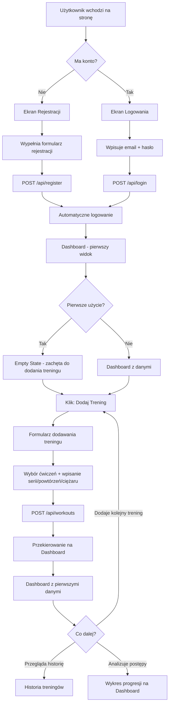
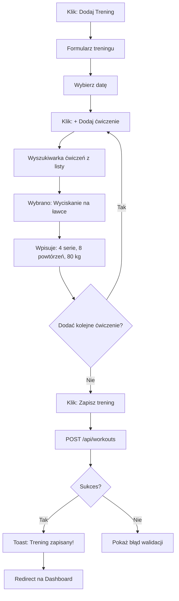
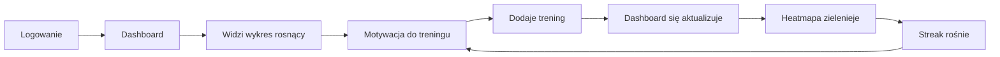
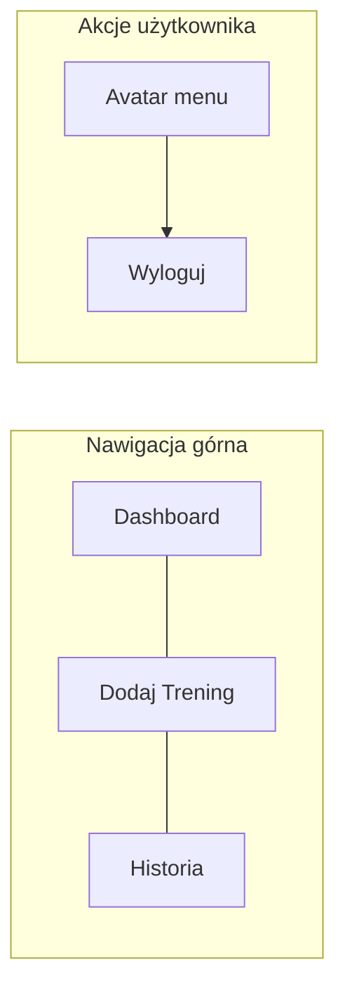

# 🗺️ WF_User_Journey_Map – FitBoard

**Cel:** Zaprojektować kompletną ścieżkę użytkownika od pierwszego kontaktu z aplikacją do momentu, w którym staje się regularnym użytkownikiem. Każdy krok musi być zmapowany na konkretny ekran i endpoint API.

---

## 1. Główna Ścieżka Użytkownika (Happy Path)



---

## 2. Szczegółowa Ścieżka – Krok po Kroku

### 🔹 Etap 1: Rejestracja / Logowanie

| Krok | Akcja użytkownika | Reakcja systemu | Ekran | API |
|---|---|---|---|---|
| 1.1 | Wchodzi na stronę | Wyświetla ekran logowania | Login | – |
| 1.2a | Klika - Zarejestruj się | Pokazuje formularz rejestracji | Register | – |
| 1.2b | Wypełnia: imię, email, hasło, powtórz hasło | Walidacja po stronie frontendu | Register | – |
| 1.2c | Klika - Zarejestruj | Tworzy konto, automatycznie loguje | Register | POST /api/register |
| 1.3a | Wpisuje email + hasło | Walidacja frontendu | Login | – |
| 1.3b | Klika - Zaloguj | Logowanie, token Sanctum zapisany | Login | POST /api/login |
| 1.4 | – | Przekierowanie na Dashboard | Dashboard | GET /api/stats/dashboard |

**Emocja użytkownika:** Ciekawość → Oczekiwanie

**[RISK]:** Jeśli rejestracja wymaga zbyt wielu pól, użytkownik może zrezygnować. **Mitygacja:** Minimum pól: imię, email, hasło.

---

### 🔹 Etap 2: Pierwszy Kontakt z Dashboardem (Empty State)

| Krok | Co widzi użytkownik | Cel UX |
|---|---|---|
| 2.1 | Dashboard z pustymi kartami statystyk (0 treningów, 0 ćwiczeń) | Nie zostawiaj pustego ekranu |
| 2.2 | Komunikat: - Dodaj swój pierwszy trening, aby zobaczyć statystyki! | Jasny Call-to-Action |
| 2.3 | Duży przycisk - + Dodaj Trening | w centrum ekranu | Prowadzi do akcji |

**Emocja użytkownika:** Lekka dezorientacja → Zachęta do działania

> **⚠️ Kluczowa zasada UX:** Empty state to Twoja szansa na zrobienie dobrego wrażenia. NIE zostawiaj pustego dashboardu. Pokaż, jak będzie wyglądał po dodaniu danych (np. blady watermark wykresu z podpisem - Tu pojawi się Twój wykres postępów).

---

### 🔹 Etap 3: Dodawanie Pierwszego Treningu



| Krok | Akcja użytkownika | Reakcja systemu | Ekran | API |
|---|---|---|---|---|
| 3.1 | Klika - + Dodaj Trening | Otwiera formularz | Nowy Trening | – |
| 3.2 | Wybiera datę (domyślnie dzisiaj) | Date picker | Nowy Trening | – |
| 3.3 | Klika - + Dodaj ćwiczenie | Pojawia się wiersz z selectem/wyszukiwarką ćwiczeń | Nowy Trening | GET /api/exercises |
| 3.4 | Wybiera ćwiczenie z listy | Autokompletacja po wpisaniu 2 liter | Nowy Trening | – |
| 3.5 | Wpisuje serie, powtórzenia, ciężar | Inputy numeryczne z walidacją | Nowy Trening | – |
| 3.6 | Opcjonalnie dodaje kolejne ćwiczenia (powtarza 3.3-3.5) | Dynamiczne dodawanie wierszy | Nowy Trening | – |
| 3.7 | Klika - Zapisz trening | Loading spinner, walidacja, zapis | Nowy Trening | POST /api/workouts |
| 3.8 | – | Toast: sukces, redirect na Dashboard | Dashboard | GET /api/stats/dashboard |

**Emocja użytkownika:** Działanie → Satysfakcja z zapisanego treningu

**[RISK]:** Formularz dynamiczny (dodawanie wielu ćwiczeń) to najtrudniejszy element frontendu. **Mitygacja:** Użyj `v-for` na reactive array w Pinia. Zacznij od wersji z 1 ćwiczeniem, potem dodaj dynamiczne dodawanie.

---

### 🔹 Etap 4: Dashboard z Danymi (Aha! Moment)

| Krok | Co widzi użytkownik | Dane |
|---|---|---|
| 4.1 | Karta: - 1 trening | z agregacji `/api/stats/dashboard` |
| 4.2 | Karta: - 1 trening w tym tygodniu | z agregacji |
| 4.3 | Heatmapa: 1 zielony kafelek na dzisiejszym dniu | z listy dat treningów |
| 4.4 | Wykres progresji: 1 punkt na wykresie (za mało na linię) | z `/api/stats/progress/:id` |
| 4.5 | Komunikat przy wykresie: - Dodaj więcej treningów, żeby zobaczyć trend | UX guidance |

**Emocja użytkownika:** "Aha, widzę jak to działa!" → Motywacja do dodania kolejnych treningów

> **💡 Aha! Moment:** To jest krytyczny punkt. Użytkownik musi zobaczyć NATYCHMIASTOWĄ wartość po dodaniu pierwszego treningu. Dashboard nie może wyglądać tak samo jak przed dodaniem. Nawet 1 trening musi zmienić wygląd dashboardu.

---

### 🔹 Etap 5: Przeglądanie Historii

| Krok | Akcja użytkownika | Reakcja systemu | Ekran | API |
|---|---|---|---|---|
| 5.1 | Klika - Historia w nawigacji | Przejście do listy treningów | Historia | GET /api/workouts |
| 5.2 | Widzi listę treningów posortowaną od najnowszego | Karty z datą, czasem trwania, liczbą ćwiczeń | Historia | – |
| 5.3 | Klika - Szczegóły na wybranym treningu | Rozwija/otwiera szczegóły z listą ćwiczeń | Szczegóły | GET /api/workouts/:id |
| 5.4 | Opcjonalnie: filtruje po miesiącu | Aktualizacja listy | Historia | GET /api/workouts?month=3 |

**Emocja użytkownika:** Przeglądanie → Satysfakcja z historii

---

### 🔹 Etap 6: Powracający Użytkownik (Retention Loop)



To jest retention loop: **Trening → Wizualny feedback → Motywacja → Kolejny trening**.

---

## 3. Mapa Stanów Ekranów

### Dashboard – 3 stany:

| Stan | Warunek | Co wyświetlić |
|---|---|---|
| **Empty** | 0 treningów | Komunikat zachęcający + duży przycisk CTA |
| **Początkowy** | 1-3 treningi | Karty z danymi, heatmapa z kilkoma kafelkami, wykres z 1-3 punktami + podpowiedź |
| **Pełny** | 4+ treningi | Pełny dashboard z wykresami, heatmapą, statystykami |

### Formularz treningu – 2 stany:

| Stan | Warunek | Co wyświetlić |
|---|---|---|
| **Nowy** | Tworzenie treningu | Puste pola, data = dzisiaj |
| **Edycja** | Edycja istniejącego (SHOULD HAVE) | Wypełnione pola z danymi |

### Historia – 2 stany:

| Stan | Warunek | Co wyświetlić |
|---|---|---|
| **Empty** | 0 treningów | Komunikat: Nie masz jeszcze treningów |
| **Z danymi** | 1+ treningów | Lista z paginacją |

---

## 4. Nawigacja



**3 pozycje w nawigacji. Nic więcej.** Prostota to klucz.

| Element nawigacji | Route | Widok Vue |
|---|---|---|
| Dashboard | / | DashboardView.vue |
| Dodaj Trening | /workout/new | WorkoutFormView.vue |
| Historia | /history | HistoryView.vue |
| Login | /login | LoginView.vue |
| Rejestracja | /register | RegisterView.vue |
| Szczegóły treningu | /workout/:id | WorkoutDetailView.vue |

**6 route'ów Vue Router.** To jest cała aplikacja.

---

## 5. Kluczowe Interakcje UX

### 5.1 Dynamiczny formularz ćwiczeń
```
[Ćwiczenie 1]  [Serie: 4] [Powt: 8] [Kg: 80] [🗑️]
[Ćwiczenie 2]  [Serie: 3] [Powt: 10] [Kg: 60] [🗑️]
[+ Dodaj ćwiczenie]
```
- Każde ćwiczenie to osobny wiersz
- Przycisk usuwania przy każdym wierszu
- Przycisk dodawania na dole
- Select/autocomplete ćwiczeń z predefiniowanej listy

### 5.2 Heatmapa aktywności
```
Pon  ░░░█░░░░█░░░
Wto  ░░░░░░░░░░░░
Śro  ░█░░░█░░░█░░
Czw  ░░░░░░░░░░░░
Pią  █░░░█░░█░░░░
Sob  ░░░░░░░░░░░░
Nie  ░░░░░░░░░░░░
```
- Grid CSS (7 wierszy x N kolumn, w zależności od liczby tygodni)
- Kolory: brak treningu = szary, trening = zielony (odcień zależy od intensywności)
- Tooltip z datą i nazwą treningu po hover

### 5.3 Wykres progresji
- Wykres liniowy ApexCharts
- Oś X: daty treningów
- Oś Y: ciężar (kg)
- Dropdown do wyboru ćwiczenia
- Animacja rysowania linii przy pierwszym załadowaniu

---

## 6. Podsumowanie Techniczne – Co Wdrożyć

| Element | Technologia | Priorytet |
|---|---|---|
| Routing | Vue Router | MUST |
| State management | Pinia | MUST |
| HTTP client | Axios z interceptorami auth | MUST |
| Wykresy | vue3-apexcharts | MUST |
| Heatmapa | Custom CSS Grid component | SHOULD |
| Formularze | Vuetify forms + VeeValidate | MUST |
| Tabele/Listy | Vuetify data table lub custom cards | MUST |
| Toast notifications | Vuetify snackbar | SHOULD |
| Date picker | Vuetify date picker | MUST |
| Autocomplete ćwiczeń | Vuetify autocomplete | MUST |

---

## 7. Następny Krok

User Journey jest kompletny. Masz teraz pełny obraz:
1. ✅ **Pomysły** – 3 koncepcje, wybrano FitBoard
2. ✅ **Kill The Idea** – ryzyka zidentyfikowane i zamitygowane
3. ✅ **MVP Scope** – 4 ekrany, 11 endpointów, 4 tabele, priorytetyzacja MoSCoW
4. ✅ **User Journey** – kompletna ścieżka użytkownika z mapą stanów i UX

**Gotowy do kodowania.** Rekomendowany następny krok: przejście do trybu Code i rozpoczęcie od Fazy 1 (Fundament).
